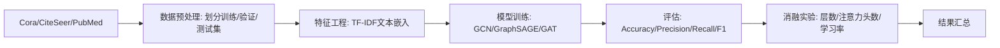

# PaperAI 写作全功能验证用例

## 测试目标

验证从创建论文 → AI生成 → 公式/图表/流程图渲染 → 多格式导出 的全链路

---

## 一、写作表单填写

打开 `http://localhost:5173/write`，填写：

| 字段 | 填写内容 |
|------|---------|
| 流程 | **深度研究** (deep_research) |
| 论文主题 | 基于图注意力网络的学术论文引用预测方法研究 |
| 详细描述 | 研究如何利用GAT模型预测学术论文之间的引用关系。包括：1) 论文特征提取（标题、摘要、关键词的文本嵌入）；2) 引文网络构建（以论文为节点、引用关系为边）；3) GAT注意力机制的改进方案；4) 在Cora、CiteSeer、PubMed数据集上的实验对比；5) 与传统GCN、GraphSAGE方法的性能分析 |
| 关键词 | 图注意力网络, 引用预测, 引文网络, GAT, 图神经网络 |
| 章节结构 | 引言, 相关工作, 方法论, 实验设计, 结果分析, 讨论与展望, 结论 |
| 附加要求 | 1. 在方法论章节用mermaid绘制模型架构流程图；2. 在实验设计章节用mermaid绘制实验流程图；3. 在结果分析章节用chart-json生成性能对比柱状图（对比GCN、GraphSAGE、GAT在不同数据集上的准确率）；4. 在讨论章节用chart-json生成参数敏感度折线图；5. 用KaTeX公式描述GAT注意力机制的数学原理 |
| 审稿迭代轮次 | 5 |
| 知识图谱 | (可选) 选择"图神经网络研究图谱" |

---

## 二、预期AI生成内容

### 2.1 KaTeX 公式

在方法论章节应包含类似公式（行内和块级）：

$$e_{ij} = \text{LeakyReLU}\left(\vec{a}^T [\mathbf{W}\vec{h}_i \Vert \mathbf{W}\vec{h}_j]\right)$$

行内公式如 $\alpha_{ij} = \text{softmax}_j(e_{ij})$ 也应正确渲染。

### 2.2 Mermaid 流程图

在方法论章节应包含 GAT 模型架构图：

```mermaid
graph TD
    A[输入: 论文特征向量] --> B[线性变换: W×h]
    B --> C[注意力系数计算: a(W·hi || W·hj)]
    C --> D[LeakyReLU激活]
    D --> E[Softmax归一化: αij]
    E --> F[邻居特征加权聚合]
    F --> G[多头注意力拼接]
    G --> H[输出: 节点嵌入]
    H --> I[MLP分类器: 引用预测]
```

在实验设计章节应包含实验流程图：



### 2.3 ECharts 数据图表

在结果分析章节应包含性能对比柱状图：

```chart-json
{
  "title": {"text": "各模型在三个数据集上的准确率对比", "left": "center", "textStyle": {"color": "#ccc"}},
  "tooltip": {"trigger": "axis"},
  "legend": {"data": ["GCN", "GraphSAGE", "GAT"], "bottom": 0, "textStyle": {"color": "#999"}},
  "xAxis": {"data": ["Cora", "CiteSeer", "PubMed"], "axisLabel": {"color": "#999"}},
  "yAxis": {"axisLabel": {"color": "#999"}},
  "series": [
    {"name": "GCN", "type": "bar", "data": [0.815, 0.712, 0.790]},
    {"name": "GraphSAGE", "type": "bar", "data": [0.823, 0.725, 0.788]},
    {"name": "GAT", "type": "bar", "data": [0.830, 0.740, 0.802]}
  ]
}
```

在讨论章节应包含参数敏感度折线图：

```chart-json
{
  "title": {"text": "GAT注意力头数对性能的影响", "left": "center", "textStyle": {"color": "#ccc"}},
  "tooltip": {"trigger": "axis"},
  "xAxis": {"data": ["1", "2", "4", "8", "16"], "name": "注意力头数", "nameTextStyle": {"color": "#999"}, "axisLabel": {"color": "#999"}},
  "yAxis": {"name": "Accuracy", "nameTextStyle": {"color": "#999"}, "axisLabel": {"color": "#999"}},
  "series": [
    {"type": "line", "data": [0.795, 0.815, 0.830, 0.825, 0.818], "smooth": true}
  ]
}
```

---

## 三、验证步骤

### 步骤1：创建论文
| 操作 | 预期 |
|------|------|
| 填写上述所有字段 | 表单无报错 |
| 点击「开始写作」 | 右侧出现实时进度，SSE连接成功 |
| 观察步骤进度条 | 依次显示选题→调研→大纲→写作→审稿(×5)→润色→终审 |

### 步骤2：验证公式渲染
| 操作 | 预期 |
|------|------|
| 在方法论文本中查找 `$$` 或 `$` | KaTeX正确渲染为数学公式 |
| 验证符号完整 | 矩阵符号、上下标、希腊字母、分数均完整 |

### 步骤3：验证Mermaid图表
| 操作 | 预期 |
|------|------|
| 查找 `\`\`\`mermaid` 代码块 | 被替换为SVG流程图，箭头和节点清晰可见 |
| 暗色主题 | 图表背景与页面暗色主题一致 |

### 步骤4：验证ECharts图表
| 操作 | 预期 |
|------|------|
| 查找 `\`\`\`chart` 代码块 | 被替换为ECharts交互式图表 |
| 悬停图表 | 出现tooltip数据提示 |
| 窗口resize | 图表自适应宽度 |

### 步骤5：验证导出
| 操作 | 预期 |
|------|------|
| 写作完成后进入论文详情页 `/paper/:id` | 三栏布局正常 |
| 点击「导出 → Word (.docx)」 | 下载.docx文件，用Word打开格式正确 |
| 点击「导出 → PDF (.pdf)」 | 下载.pdf文件，文字/标题层级正确 |
| 点击「导出 → HTML (.html)」 | 浏览器打开，表格/代码块样式正常 |
| 点击「导出 → LaTeX (.tex)」 | 下载.tex文件，含`\section`等结构 |

---

## 四、回归检查清单

- [ ] 5个内置Agent的SSE推送正常（导师→研究员→写作者→审稿人→润色师）
- [ ] 审稿迭代正确循环（DEEP_RESEARCH应执行5轮）
- [ ] 版本管理正常（写作完成后自动保存FINAL版本）
- [ ] 参考文献标签页显示AI提取的引用
- [ ] 知识图谱关联数据能注入到写作上下文
- [ ] 流程画布中自定义Agent可拖拽使用
